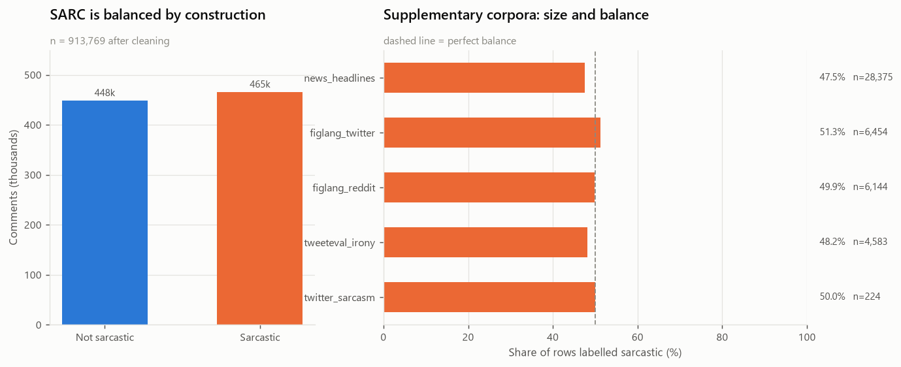
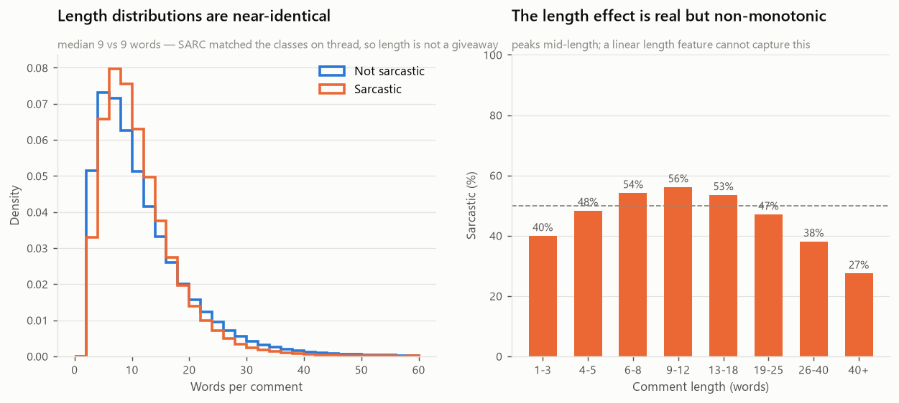
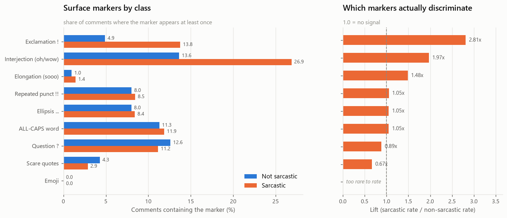
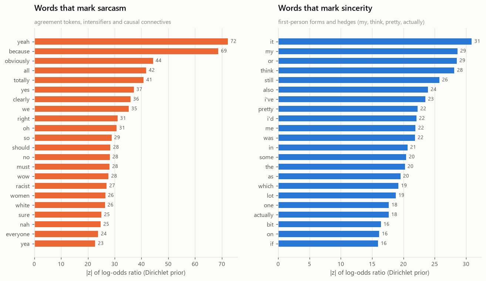
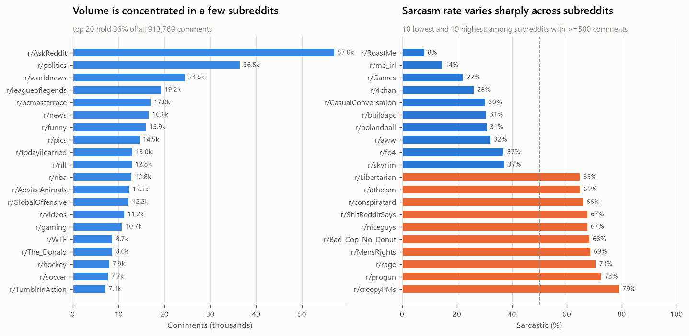
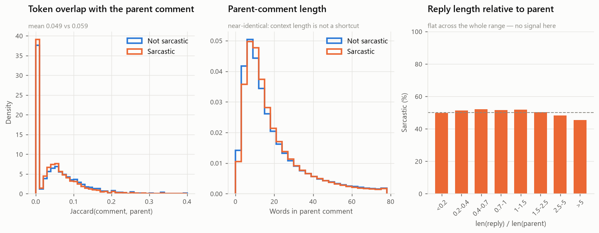
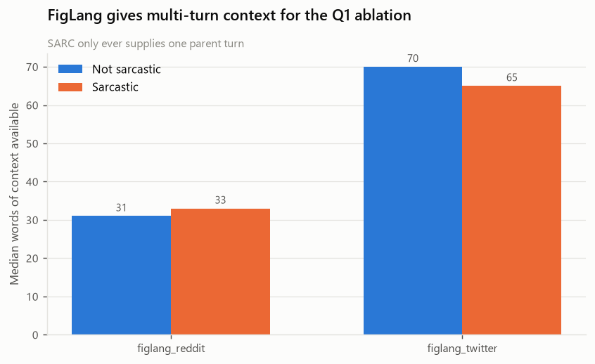
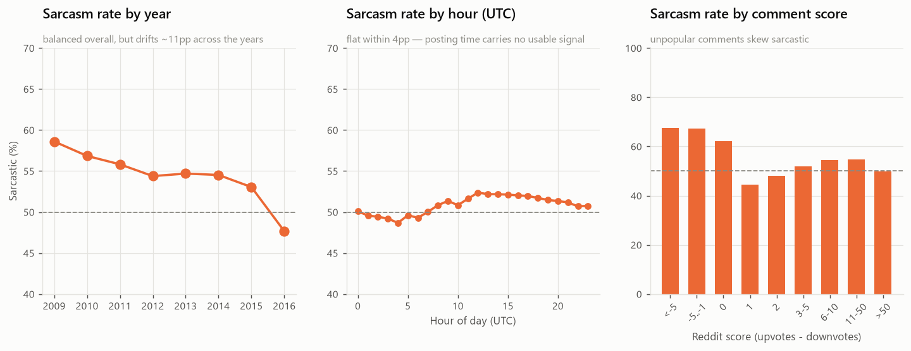
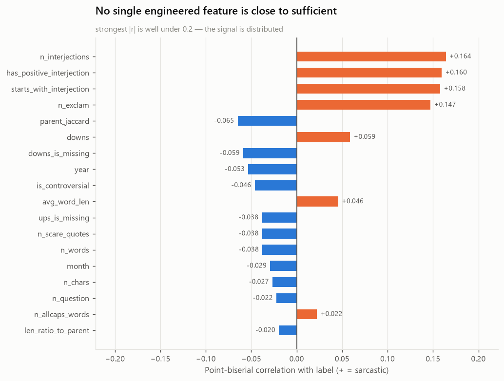
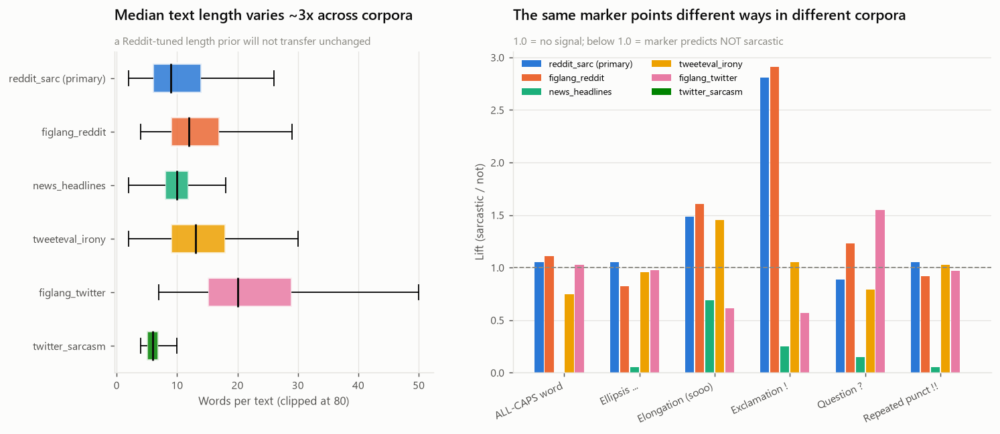

# EDA Report — *For Real?: Identifying markers of sarcasm through explainable ML*

Corpora: **913,769** cleaned Reddit comments (SARC balanced) + **45,780** rows across
four supplementary corpora.
Generated by `pipeline/03_eda.py`; every number below is reproduced in
`results/eda/eda_statistics.json`, every figure in `figures/eda/`.

---

## TL;DR — the eight things that should change the project plan

1. **There is no label leakage left in SARC.** Only 16 comments in 1.01M still
   carried a `/s`, and the rate is *equal* across classes. The balanced Kaggle
   file was de-leaked by its authors. Good news, but it had to be checked —
   and the Twitter corpora are a different story (point 7).
2. **2.86% of SARC is self-contradictory.** 4,043 distinct comment texts appear
   with *both* labels — 28,881 rows. The same string is sarcastic in one thread
   and sincere in another. This is a hard ceiling on achievable accuracy and
   the single best argument in the proposal's favour that context is required.
3. **Length is not the shortcut it looks like.** Median length is 9 words for
   *both* classes. SARC sampled its negatives as siblings under the same
   parent, which controlled length away. The residual effect is non-monotonic
   (40% sarcastic at 1–3 words, 56% at 9–12, 27% at 40+), so a linear length
   feature will underperform a binned one.
4. **Two surface markers carry real signal; the rest are noise.** Exclamation
   marks 2.81× and interjections ("oh", "wow", "yeah") 1.97×. ALL-CAPS,
   ellipsis and repeated punctuation are all ~1.05× — i.e. nothing. Scare
   quotes run *backwards* (0.67×). Emoji are absent from 2009–2016 Reddit
   entirely and must be dropped from the feature set for this corpus.
5. **Subreddit is a very strong predictor — dangerously so.** Among 268
   subreddits with ≥500 comments the sarcasm rate ranges from **8.1%
   (r/RoastMe) to 79.1% (r/creepyPMs)**. Sub-question 3 has an answer before
   any model is trained; the risk is that the model learns community identity
   instead of sarcasm.
6. **Parent-comment *statistics* carry almost nothing.** Parent length is
   identical across classes (median 14 words), the reply/parent length ratio
   is flat at 45–52%, and token overlap with the parent is marginally *lower*
   for sarcasm (0.049 vs 0.059). If context helps, it must help semantically.
   Surface features of the parent will not deliver sub-question 1.
7. **The `nikesh66/Sarcasm-dataset` is synthetic and should be dropped.** Its
   5,000 rows reduce to **240 unique texts** generated from a handful of
   templates ("Can't wait for more of *artists*" ×49, "…*musicians*" ×48).
   `tweeteval_irony` (SemEval-2018 Task 3A, human-annotated) is the correct
   cross-platform benchmark and is already downloaded.
8. **The news-headline corpus has no usable train/test split.** 100.0% of the
   26,602 unique `test.json` headlines also appear in `train.json`. The
   project must create its own split.

---

## Q0 — Size, balance and shape

| corpus | rows (clean) | % sarcastic | platform |
|---|---:|---:|---|
| **reddit_sarc (primary)** | **913,769** | **50.9%** | Reddit |
| news_headlines | 28,375 | 47.5% | news |
| figlang_twitter | 6,454 | 51.2% | Twitter |
| figlang_reddit | 6,144 | 50.0% | Reddit |
| tweeteval_irony | 4,583 | 48.1% | Twitter |
| twitter_sarcasm | 224 | 50.0% | Twitter (synthetic — do not use) |

Everything is close enough to balanced that **accuracy is a meaningful metric**
and no resampling is needed. The proposal's emphasis on precision still holds
for the stated cost asymmetry, but class imbalance is not the reason.

Median 9 words in both classes; mean 10.9 (sarcastic) vs 11.5. The p90 gap
(19 vs 22 words) is the only visible difference. **Do not expect length to be a
useful standalone feature**, but do bin it — the rate curve has a clear hump.

---

## Q2 — Do linguistic cues carry signal?

| marker | not sarcastic | sarcastic | lift |
|---|---:|---:|---:|
| Exclamation `!` | 4.9% | 13.8% | **2.81×** |
| Interjection (oh/wow/yeah) | 13.6% | 26.9% | **1.97×** |
| Elongation (sooo) | 1.0% | 1.4% | 1.49× |
| Repeated punctuation `!!` | 8.0% | 8.5% | 1.05× |
| Ellipsis `…` | 8.0% | 8.4% | 1.05× |
| ALL-CAPS word | 11.3% | 11.9% | 1.05× |
| Question `?` | 12.6% | 11.2% | 0.89× |
| Scare quotes | 4.3% | 2.9% | 0.67× |
| Emoji | 0.0% | 0.0% | n/a |

Two findings worth writing up:

* **Scare quotes invert.** Everyone's intuition says `he's a "genius"` is
  sarcastic. In SARC, quoted spans are *more* common in sincere comments —
  because on Reddit quoting is mostly used to cite the parent, not to sneer.
  A good example of a cue that is real in prose and wrong on this platform.
* **Emoji cannot be used here.** SARC ends in 2016, before emoji were common
  in Reddit comments — 0.0% of comments contain one, in either class. The
  feature is live on Twitter (12.1% / 9.4% presence in `tweeteval_irony`) but
  even there it points *away* from irony (0.78×), and harder still on
  `figlang_twitter` (0.40×). Emoji mark sincere enthusiasm, not sarcasm.

### Which words actually mark sarcasm

Ranked by log-odds ratio with an informative Dirichlet prior (Monroe et al.
2008) — the standard estimator, because raw frequency returns stopwords and
raw ratios return typos.

**Sarcastic:** `yeah` (z=72), `because` (69), `obviously` (44), `all` (42),
`totally` (41), `yes` (37), `clearly` (36), `we` (35), `right` (31), `oh` (31),
`so` (29), `should` (28), `must` (28), with `wow`, `sure` and `nah` just behind.

This is a textbook result and it is the strongest evidence for sub-question 2:
the markers are **agreement tokens, intensifiers and causal connectives** —
exactly the machinery of mock-agreement ("yeah, *obviously* that's why…").
`because` ranking second is the fake-explanation construction.

**Sincere:** `it`, `my`, `or`, `think`, `still`, `also`, `i've`, `pretty`,
`i'd`, `me` — first-person forms and hedges, i.e. the register of someone
stating their own view rather than performing someone else's.

> ⚠️ **Topic confound.** `women`, `racist` and `white` also rank in the top 20
> sarcastic tokens. Combined with the subreddit result below, this means part
> of the "sarcasm signal" is really *political-thread* signal. The ablation in
> step 8 of the plan must control for this, and the feature-attribution write-up
> should say so explicitly rather than presenting these as sarcasm markers.

---

## Q3 — Is the subreddit necessary?

13,970 subreddits; the top 20 hold 35.7% of all comments; 268 have ≥500
comments. Among those 268 the sarcasm rate spans **8.1% → 79.1%** (σ = 0.083).

| lowest | rate | highest | rate |
|---|---:|---|---:|
| r/RoastMe | 8.1% | r/creepyPMs | 79.1% |
| r/me_irl | 14.4% | r/progun | 72.6% |
| r/Games | 22.3% | r/rage | 70.6% |
| r/4chan | 26.2% | r/MensRights | 68.6% |
| r/CasualConversation | 30.3% | r/Bad_Cop_No_Donut | 68.2% |

The interpretation matters more than the number. r/RoastMe is *entirely*
insult humour, so nobody marks `/s` — the convention is redundant there. The
high-rate subreddits are argument communities where `/s` disambiguates a
hostile reply. **The subreddit predicts the `/s` annotation convention, not
the presence of sarcasm.** That is the honest framing for sub-question 3, and
it is a more interesting answer than "yes, topic helps".

Practical consequence: hold subreddits out *by name* when splitting, or the
test score measures memorised community priors.

---

## Q1 — Does thread context carry signal?

| statistic | not sarcastic | sarcastic |
|---|---:|---:|
| Jaccard overlap with parent | 0.059 | 0.049 |
| Parent length (median words) | 14 | 14 |
| Sarcasm rate by reply/parent length ratio | 45–52% across all eight bins | |

All three are flat or slightly backwards. **Every cheap statistical summary of
the parent comment is uninformative.** This does not refute sub-question 1 — it
sharpens it: if context helps, the gain must come from *semantic* incongruity
between reply and parent (sentiment flip, entailment violation), not from
length, overlap or position.

SARC only ever supplies one parent turn. `figlang_reddit` / `figlang_twitter`
supply the full conversation chain, which is why they were included — they let
the Q1 ablation be run at 1 turn vs *n* turns, which SARC alone cannot do.

---

## Temporal and popularity signal

* **Year drifts 11pp** (58.6% sarcastic in 2009 → 47.7% in 2016). SARC is
  balanced in aggregate but not within any year. Any random split leaks this.
* **Hour of day is flat within 4pp** — drop it.
* **Score is informative at the tails**: comments scoring below −1 are ~67%
  sarcastic, comments at +1 are 45%. Plausibly real (sarcasm gets downvoted
  when missed), but it is a *post-hoc* signal unavailable at prediction time in
  any realistic deployment. Use it for analysis, not as a model feature.

Point-biserial correlation with the label, strongest first:

| feature | r |
|---|---:|
| n_interjections | +0.164 |
| has_positive_interjection | +0.160 |
| starts_with_interjection | +0.158 |
| n_exclam | +0.147 |
| parent_jaccard | −0.065 |
| downs | +0.059 |
| year | −0.053 |

**No engineered feature exceeds |r| = 0.17.** The signal is genuinely
distributed across the text, which justifies the proposal's plan to use a
learned text representation and *explain* it, rather than hand-crafting
features and hoping.

> ⚠️ **Trap:** `ups`/`downs` are the placeholder −1 in most rows, and
> `downs_is_missing` correlates with the label at −0.059. That is a
> *collection artefact* — which rows Reddit still exposed vote counts for —
> not a property of sarcasm. Drop `ups`, `downs` and their missingness flags
> from any model.

---

## Q4 — Does any of this transfer off Reddit?

Median length varies ~3× across corpora (news headlines ~9 words,
figlang_twitter ~20). More importantly, **the same marker points in opposite
directions in different corpora**:

| marker | reddit_sarc | figlang_reddit | news_headlines | tweeteval_irony | figlang_twitter |
|---|---:|---:|---:|---:|---:|
| Exclamation `!` | 2.81× | 2.90× | 0.25× | 1.06× | 0.58× |
| Question `?` | 0.89× | 1.24× | 0.15× | 0.80× | 1.55× |
| Ellipsis `…` | 1.06× | 0.84× | 0.05× | 0.97× | 0.98× |

The exclamation-mark cue generalises perfectly across the two Reddit corpora
(2.81× vs 2.90×) and **inverts on news headlines** (0.25×), where an
exclamation mark signals a HuffPost listicle rather than an Onion parody.
Expect a Reddit-trained model to lose most of its punctuation-based
performance on any other platform, and design the cross-platform evaluation
to measure exactly that.

---

## What to do next

1. **Split by subreddit and by time**, not at random. A random split leaks both
   the community prior and the year drift.
2. **Drop** `ups`, `downs`, `*_is_missing`, `hour_utc`, `n_emoji` from the
   feature set for the primary corpus. Keep `score` for analysis only.
3. **Bin** `n_words` rather than using it linearly.
4. **Use `tweeteval_irony` as the cross-platform test set** and drop
   `twitter_sarcasm` entirely. Note the drop and the reason in the report —
   "we audited it and it failed" is a stronger result than silence.
5. **Re-split `news_headlines` yourself** — its shipped split is 100%
   contaminated.
6. **For the Q1 ablation, use `figlang_*`** to get more than one turn of
   context; SARC can only test "one parent vs none".
7. **Report the ~2.9% contradictory-label floor** when discussing the ceiling
   on accuracy.
8. **Guard the feature-attribution section against the topic confound**: report
   subreddit-controlled attributions, or the top "sarcasm markers" will include
   `women`, `racist` and `white`.
